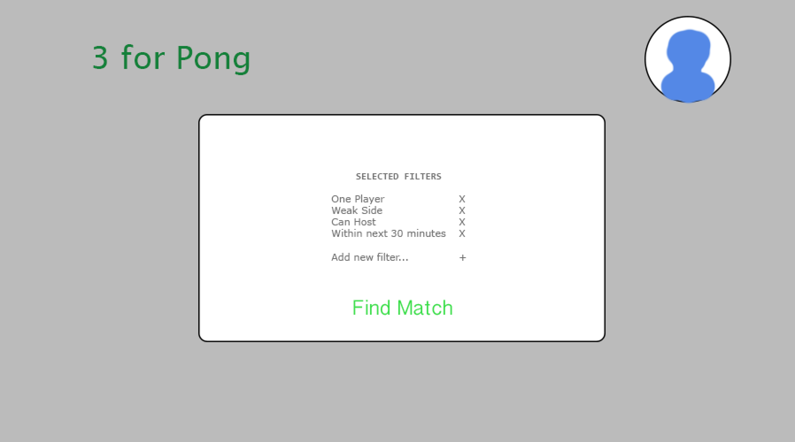
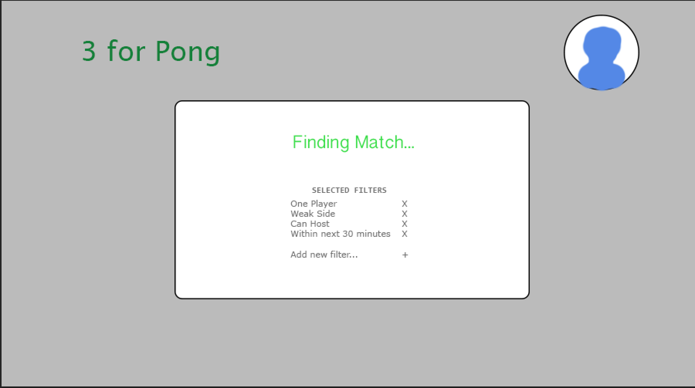

# Three-For-Pong

3fp is a platform that allows students to find pong games anonymously. By connecting students, we will reduce pong wait times and foster potential friendships.

### Home Page Instances

TODO: short project description, some sample screenshots or mockups

## Architecture

### Front End

Our front end design will be built using React+Redux

### Back End

Our back end design will focus on using Firebase. 

TODO:  descriptions of code organization and tools and libraries used

## Setup

TODO: how to get the project dev environment up and running, npm install etc

## Deployment

How to Deploy the Project:

Currently, the project is set up to run on a local server. So, first set up the server with mongod. For instance, create any directory to store data and then run

mongod --dbpath <path to data directory>

Then, while mongod is still running, go to the directory of HackHubAPIServer. There, run

npm run dev

This should set up the local server on localhost:9090. The current project is set up to use this server, so it should run correctly.

To test the project, run

npm start

and go to localhost:8080.

## Authors

Devina Kumar, Virginia Cook, Jonathan Gonzalez, Henry Wilson, Matthew Goldstein

## Acknowledgments
