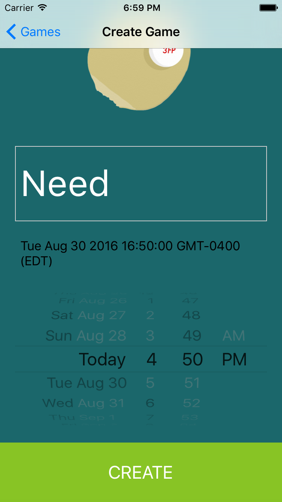

# Three-For-Pong

3fp is a platform that allows students to find pong games anonymously. By connecting students, we will reduce pong wait times and foster potential friendships.

## Site Map


## Wireframes


##Mock-Ups


## Architecture

### Front End

The front end of Three for Pong was built using React Native. It is relatively simple, and can be broken down into seven components, as follows:

- **Start Up** – upon starting up the app, users (if not logged in) are taken to a screen featuring the logo, on which they can either choose to register or log in.


- **Register** – the register component uses a specially-designed form (documentation can be found [here](https://github.com/gcanti/tcomb-form)). This form takes inputs for the user's full name, email address, phone number, password, password confirmation, and features a menu in which the user can select the location at which they are able to host games (if they've indicated they can host a game). On an error with any of the fields, the user will be prompted to input the correct type of information. The page validates proper phone numbers (no letters allowed) and email addresses (must be @dartmouth.edu, and must feature one of the four class numbers currently on campus: 17, 18, 19, or 20). Additionally, it checks to make sure the passwords match. Once all of the information is input and the user clicks 'register,' an email with a pin code will be sent to the email address provided.


- **Pin Authorization** – on this page, the user is prompted to enter the pin that has been sent to their email. The page validates the pin, and once it has determined it to be correct, leads to the page where the user can view available games.


- **Login** – the user is prompted to input their Dartmouth email address and password. If the credentials are input incorrectly, the user will see an error message telling them to input Dartmouth email and password. Once the correct credentials are input and the user hits 'login,' they are taken to the available games page.


- **Dashboard** – the dashboard is where the user sees all of the available games that have been created but not filled. The games appear in a scrollable format, with the form "Need **[number]** at **[location]** at **[time]**". They also each feature a **+** button, which, on clicking, adds the user to that game and decrements the number of people needed. When the number reaches 0, the game will disappear from the dashboard. From the dashboard, the user can click 'create game' to get to the game creation component, or 'settings' to access and change their settings.


- **Settings** – here, the user can change their phone number, the default location they set on registering, and their password.


- **Create Game** – in this component, the user can choose how many players they need for their game. Also, using an iPhone date-scroll bar, the user can choose when they'd like their game to happen. To get a location, the app defaults to the default location the user provided when they registered. Once the game is created, it will show up on the dashboard in the aforementioned format.


*NOTE: Unfortunately, we were not able to figure out a viable way to replace the IOS top navigation bar with 'back' buttons of our own. React Native was very fickle on the subject, and navigation through the stack on apps in general is tricky. While it's aesthetically not the best, and while it allows for the unfortunate quirk of being able to get back to the login screen from the dashboard, this was the best option available to us.*

### Back End

Our back end design will use MongoDB hosted on Heroku.
In addition, we will use Nexmo's SMS API (https://www.nexmo.com/products/sms/) to send an SMS to students once they have been matched. We will use Axios to interact with Nexmo's API in addition to our Heroku database.

## Setup

To get the project running, run these commands:

```
brew install node
brew install watchman
npm install -g react-native-cli
```
In addition, X-Code and its command-line tools must be installed.

## Deployment

To deploy the project, first go into the project folder (ThreeForPong in this case), and then run
```
react-native run-ios
```

This will start an iPhone simulator, which can be updated with a simple cmd+R when you update a feature.


## Authors

Devina Kumar, Virginia Cook, Jonathan Gonzalez, Henry Wilson, Matthew Goldstein

## Acknowledgments
Starter code taken from React Native Workshop in class
